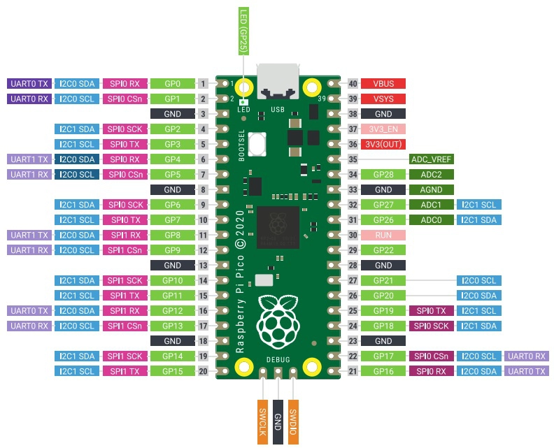

#Przykładowe kody dla warsztatów 2022

##Opis pinów dla RPI PICO

- GPx - pin gpio (wyjście/wejście)
- GND - uziemienie
- SPIx - piny x interfejsu SPI
- I2Cx - piny x interfejsu I2C
- UARTx - piny x interfejsu UART
- VBUS - zasilanie z portu USB +5V
- VSYS - wejście zasilania od 1.8V do 5.5V
- 3V3 - zasilanie 3.3V
- 3V3_EN - podpięcie do uziemienia powoduje wyłączenie zasilania 3.3V i samego mikrokontrolera
- RUN - zwarcie pinu do uziemienia powoduje wyłączenie mikrokontrolera, może być użyte do resetowania mikrokontrolera

Piny GPIO26-29 mogę być użyte jako wejścia analogowe z rozdzielczością 12bit

##Przykłady

###LED_BLINK

Proste miganie wbudowaną diodą.

###LED_PWM

Sterowanie jasnością wbudowanej diody.

###BUTTON_PRESS

Uruchamianie diody przy pomocy przycisku.

###BUTTON_INTERUPT

Uruchamianie diody przy pomocy przycisku za pomocą przerwania.

###SENSOR_READING

Test czyjników odległości TOF VL53L0X.

